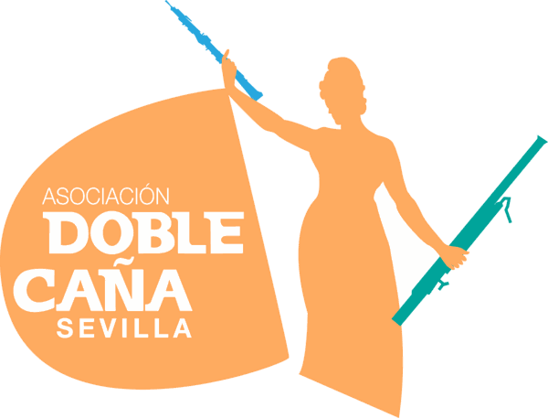
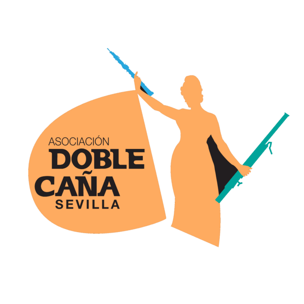

# ADCS Sevilla — Web

Sitio web estático de la **Asociación de Doble Caña de Sevilla (ADCS)**, entidad sin ánimo de lucro que une a profesores y alumnos de **oboe** y **fagot** de Sevilla y su provincia.

🌐 Web actual a sustituir: https://adcsevilla.es (Blogger)
📍 Estado: **En desarrollo avanzado** — Estructura lista, falta contenido multimedia y despliegue

---

## 📋 Estado General del Proyecto

| Tarea | Estado | Detalles |
|-------|--------|----------|
| **Estructura HTML** | ✅ Completa | 10 páginas creadas |
| **CSS compartido** | ✅ Refactorizado | `assets/css/styles.css` (7.5 KB) |
| **Logo (real)** | ✅ Subido | `logo-claro.png` y `logo-oscuro.png` (~15 KB tras optimizar) |
| **Favicon e iconos** | ✅ Hecho | `favicon.ico`, `apple-touch-icon.png`, `icon-192/512.png`, `site.webmanifest` |
| **SEO y redes sociales** | ✅ Hecho | `description`, `canonical`, Open Graph y Twitter Card en las 16 páginas + JSON-LD en la portada |
| **`robots.txt` / `sitemap.xml`** | ✅ Hecho | 10 URLs públicas; `/socios/` excluido e marcado `noindex` |
| **Página 404** | ✅ Hecha | `404.html` + `ErrorDocument` en `.htaccess` |
| **Fotos de junta** | ⏳ Parcial | Solo Irene Pérez Cantillón en `assets/img/junta/irene.jpg` |
| **Área de socios** | 🔄 Reestructurada (Fase 1) | Multi-página en `/socios/`, contenido de ejemplo. Pendiente: Cloudflare Access (Fase 2) y contenido real |
| **GitHub Pages** | ❌ Pendiente | Repositorio en origin/main, pero DNS no apunta aún |
| **Validación móvil** | ✅ Verificado | 17 páginas × 4 anchos (320/375/414/768 px): sin desbordamiento horizontal |
| **Optimización de imágenes** | ✅ Hecha | Logos −77 %, foto de junta −73 % (sin pérdida visible) |

---

## 📁 Estructura del Proyecto

```
ADCS Web/
├── CONTEXT.md                          ← Briefing original del proyecto
├── README.md                           ← Este archivo (análisis completo)
├── ACCESIBILIDAD.md                    ← Registro de mejoras de accesibilidad
├── .gitignore                          ← Archivos a ignorar en Git
├── .htaccess                           ← Config. Apache para Hostalia (404, gzip, caché, cabeceras)
├── robots.txt                          ← Permite indexar todo excepto /socios/
├── sitemap.xml                         ← 10 URLs públicas
├── site.webmanifest                    ← Nombre e iconos al añadir a pantalla de inicio
├── favicon.ico                         ← Icono de pestaña
│
├── 📄 PÁGINAS PÚBLICAS:
│   ├── index.html                      ✅ Página de inicio (121 líneas)
│   ├── quienes-somos.html              ✅ Quiénes somos + junta (330 líneas) — 1 placeholder
│   ├── hazte-socio.html                ✅ Información de cuota (286 líneas) — 1 placeholder
│   ├── v-concurso-2026.html            ✅ V Concurso 2026 (245 líneas) — 1 placeholder
│   ├── vii-encuentro-15.html           ✅ VII Encuentro 15 años (274 líneas) — Sin placeholders
│   ├── asociaciones.html               ✅ Enlaces a webs amigas (186 líneas) — Sin placeholders
│   ├── patrocinadores.html             ✅ Patrocinadores (253 líneas) — Sin placeholders
│   ├── recursos.html                   ✅ Recursos educativos (244 líneas) — Sin placeholders
│   ├── cv-irene-perez-cantillon.html   ✅ CV especial (137 líneas) — Sin placeholders
│   └── 404.html                        ✅ Página de error (no indexada, rutas absolutas)
│
├── 🔑 ÁREA DE SOCIOS (`/socios/`) — Fase 1: estructura + contenido de ejemplo,
│   │                                  sin protección de acceso todavía (ver Fase 2 más abajo):
│   ├── index.html                      ✅ Bienvenida, accesos rápidos, novedades
│   ├── actividades.html                ✅ Concursos, encuentros, masterclasses, talleres, clases, conciertos
│   ├── archivo.html                    ✅ Archivo histórico por periodos (2010–2015 … 2026–…)
│   ├── documentacion.html              ✅ Actas, cuentas, memorias, estatutos (enlaces a Drive)
│   ├── partituras.html                 ✅ Partituras con clasificación legal + nota de criterio
│   └── participa.html                  ✅ Propuestas, sugerencias, contacto con la Junta
│
└── 📦 ASSETS:
    ├── css/
    │   └── styles.css                  ✅ Estilos compartidos (incluye componentes del área de socios)
    │
    └── img/
        ├── logo-claro.png              ✅ Logo (15 KB) — fondo blanco
        ├── logo-oscuro.png             ✅ Logo (14 KB) — fondo negro
        ├── og-adcs.png                 ✅ Imagen 1200×630 para compartir en redes
        ├── apple-touch-icon.png        ✅ Icono iOS 180×180
        ├── icon-192.png / icon-512.png ✅ Iconos del manifest
        ├── favicon-32.png              ✅ Favicon PNG 32×32
        │
        └── junta/
            └── irene.jpg               ✅ Foto de Irene (40 KB, 540×360)
```

**Total:** 10 páginas públicas + 6 páginas del área de socios = **16 páginas**.

---

## ✅ Estado Detallado de Cada Página

### 1. `index.html` — Página de inicio
- **Estado:** ✅ Completa
- **Contenido:** Hero con eslogan, stats (años, eventos, socios), banner aniversario 15 años
- **Placeholders:** Ninguno
- **Nav activo:** Sí (clase `active`)
- **Notas:** Estructura minimalista, sin secciones adicionales

### 2. `quienes-somos.html` — Quiénes somos
- **Estado:** ✅ Completa (con placeholder)
- **Contenido:** Historia, misión, junta directiva 2025-26
- **Placeholders:** 1 imagen (Historia)
  - Ubicación: Línea 126 (`div.img-placeholder.ph-historia`)
  - Qué va: Foto histórica de la ADCS
- **Fotos de junta:** 6 miembros con placeholders (círculos de color) — **FALTAN 5 FOTOS**
  - Solo existe: `assets/img/junta/irene.jpg` (Irene Pérez Cantillón)
  - Faltan: Johanna, Jesús Manuel, Jacobo, Nuria, Alejandro
- **Nav activo:** Sí

### 3. `hazte-socio.html` — Hazte socio/a
- **Estado:** ✅ Completa (con placeholder)
- **Contenido:** Información de cuota (20€ individual, 30€ hermanos), pasos de inscripción, datos IBAN, formulario Google Forms
- **Placeholders:** 1 imagen (banner)
  - Ubicación: Línea 118 (`div.img-placeholder.banner-photo`)
  - Qué va: Foto de actividad o grupo
- **Nav activo:** Sí

### 4. `v-concurso-2026.html` — V Concurso 2026
- **Estado:** ✅ Completa (con placeholder)
- **Contenido:** Información del concurso (aplazado), bases, calendario
- **Placeholders:** 1 imagen
  - Ubicación: Línea 150 (`div.img-placeholder`)
  - Qué va: Foto o cartel del concurso
- **Nav activo:** Sí (aunque el concurso está aplazado)

### 5. `vii-encuentro-15.html` — VII Encuentro (15º Aniversario)
- **Estado:** ✅ Completa
- **Contenido:** Información del evento de aniversario
- **Placeholders:** Ninguno (o no está claro)
- **Nav activo:** Sí

### 6. `asociaciones.html` — Webs amigas (Asociaciones)
- **Estado:** ✅ Completa
- **Contenido:** Enlaces a otras asociaciones de viento (oboe, fagot, doble caña)
- **Placeholders:** Ninguno
- **Últimas mejoras:** División en Asociaciones y Recursos (commit 843de20)
- **Nav activo:** Sí (aunque en nav aparece como "Asociaciones" pero el enlace dice "asociaciones.html")

### 7. `patrocinadores.html` — Patrocinadores
- **Estado:** ✅ Completa
- **Contenido:** Información sobre patrocinadores y colaboradores
- **Placeholders:** Ninguno (o placeholders de logos sin especificar)
- **Nav activo:** Sí

### 8. `recursos.html` — Recursos educativos
- **Estado:** ✅ Completa
- **Contenido:** Enlaces a recursos educativos (métodos, ejercicios, guías de digitación)
- **Placeholders:** Ninguno
- **Últimas mejoras:** Refacción de "Webs amigas" — ahora es "Recursos" (commit 843de20)
- **Nav activo:** Sí

### 9. `cv-irene-perez-cantillon.html` — CV especial
- **Estado:** ✅ Completa (página especial)
- **Contenido:** CV de Irene Pérez Cantillón (secretaria de la ADCS)
- **Placeholders:** Ninguno
- **Nav activo:** Sí
- **Uso:** Página auxiliar, probablemente sin enlace público en nav principal

### 10–15. `socios/*.html` — Área de socios (Fase 1: estructura + contenido de ejemplo)
- **Estado:** 🔄 Reestructurada — sin protección de acceso técnica todavía
- **Páginas:**
  - `socios/index.html` — bienvenida, accesos rápidos a las 5 secciones, novedades de ejemplo
  - `socios/actividades.html` — concursos, encuentros, masterclasses, talleres, clases y conciertos, agrupados por categoría con anclas internas. Eventos "importantes" (concursos, encuentros, conciertos) llevan ficha completa (`.evento-card`); actividades menores (masterclasses, talleres, clases) usan un bloque ligero (`.actividad-ligera`)
  - `socios/archivo.html` — archivo histórico agrupado por periodos (2010–2015, 2016–2020, 2021–2025, 2026–…)
  - `socios/documentacion.html` — actas, cuentas, memorias y estatutos, con enlaces a Google Drive (los PDFs no se suben al repo — ver nota de seguridad más abajo)
  - `socios/partituras.html` — partituras con etiqueta de clasificación legal (dominio público / material propio / autorización expresa) y nota sobre el criterio de publicación
  - `socios/participa.html` — enlaces a Google Forms (placeholder) para proponer actividades, sugerir repertorio o contactar con la Junta
- **Todo el contenido real (eventos, vídeos, documentos) está marcado como "contenido de ejemplo"** — pendiente de sustituir por el material real de la ADCS
- **Notas:**
  - No usa StatiCrypt ni ningún otro cifrado — ese sistema se retiró (ver sección "Autenticación" abajo)
  - Los documentos privados (actas, cuentas, memorias) **no deben subirse como archivos a este repo**, porque es público en GitHub. Deben alojarse en Google Drive con permisos restringidos y enlazarse desde `documentacion.html`
  - Rutas relativas: al vivir en `/socios/`, cada página usa `../` para enlazar a `assets/` y a las páginas públicas

---

## 🎨 Identidad Visual y Estilo

### El sistema de colores por instrumento

La web tiene **tres colores principales**, cada uno con un significado semántico claro:

| Color | Variable | Hex | Uso |
|-------|----------|-----|-----|
| **Naranja** | `--naranja` | `#FFAB60` | Color de la marca ADCS, acciones, CTA, nav activo |
| **Verde** | `--oboe` | `#4a9e6b` | Color del **oboe** — todo lo relacionado con el oboe |
| **Azul/turquesa** | `--fagot` | `#3bbfcc` | Color del **fagot** — todo lo relacionado con el fagot |

Cada color tiene tres tonos: base, dark (para hover y texto sobre fondo claro) y light (para fondos suaves):

```css
:root {
  /* Naranja — marca ADCS */
  --naranja:       #FFAB60;
  --naranja-dark:  #e8903a;
  --naranja-light: #fff4ea;

  /* Verde — oboe */
  --oboe:          #4a9e6b;
  --oboe-light:    #e8f5ee;
  /* Oscuro: no hay variable, se usa #2d6b47 puntualmente (en .tag-oboe) */

  /* Azul — fagot */
  --fagot:         #3bbfcc;
  --fagot-light:   #e6f8fa;
  /* Oscuro: no hay variable, se usa #1a8a95 puntualmente (en .tag-fagot) */

  /* Neutros */
  --texto:         #1a1a1a;
  --gris:          #666;
  --borde:         #e8e8e8;
}
```

### Regla fundamental: oboe = verde, fagot = azul

**Siempre** que las palabras "oboe" o "fagot" aparezcan en el texto, van con su color. Sin excepción:

```html
<!-- En texto corrido -->
<span class="txt-oboe">oboe</span>     → verde #4a9e6b, negrita
<span class="txt-fagot">fagot</span>   → azul  #3bbfcc, negrita

<!-- En el hero (página de inicio) -->
<span class="oboe">oboe</span>
<span class="fagot">fagot</span>
```

Esta regla se aplica en **todas las páginas**, en el hero de inicio, en las descripciones, en los subtítulos, en los formularios, etc. Es una señal de identidad de la marca.

---

### Tipografías

| Fuente | Pesos | Uso |
|--------|-------|-----|
| **Playfair Display** | 700, 900 | Títulos de página, títulos de sección, números grandes (stats) |
| **Inter** | 400, 500, 600, 700 | Todo lo demás: cuerpo, nav, botones, labels, breadcrumb |

Cargadas desde Google Fonts en el `<head>` de cada página:
```html
<link href="https://fonts.googleapis.com/css2?family=Playfair+Display:wght@700;900&family=Inter:wght@400;500;600;700&display=swap" rel="stylesheet"/>
```

Los tamaños de título usan `clamp()` para escalar en función del viewport:
- Título de página (`page-title`): `clamp(2.2rem, 5vw, 3.5rem)`
- Título de sección (`section-title`): `clamp(1.8rem, 3.5vw, 2.4rem)`
- Hero de inicio: `clamp(2.6rem, 6vw, 5.2rem)`

---

### Logo

| Archivo | Versión | Dónde se usa |
|---------|---------|-------------|
| `assets/img/logo-claro.png` | Fondo blanco | Nav superior (sticky) |
| `assets/img/logo-oscuro.png` | Fondo negro | Footer |

```html
<!-- Nav -->

<!-- Footer -->

```

Tamaños: `logo-img` → 56px alto; `logo-img-footer` → 64px alto; mobile: 48px.

---

### Componentes de estructura (presentes en todas las páginas)

#### 1. Nav superior sticky
```
[Logo ADCS] [Inicio] [Quiénes somos] [Hazte socio/a] [V Concurso] [VII Encuentro]
            [Asociaciones] [Patrocinadores] [Recursos] [🔑 Área de socios]
```
- Fondo blanco, borde inferior `--borde`
- Links en gris, `hover` y `.active` en naranja
- `.active` tiene una barra naranja de 2px debajo
- Mobile: hamburguesa `☰` que muestra/oculta el menú

#### 2. Breadcrumb (todas las páginas menos `index.html`)
```
Inicio › Nombre de la página actual
```
- Fondo `#fafafa`, borde inferior
- Separador `›` en gris claro (`#bbb`)
- Página actual en negrita

#### 3. Page header (cabecera de página)
```
┌─────────────────────────────────────────────┐
│   [badge de sección]                        │
│   TÍTULO GRANDE CON PLAYFAIR                │
│   Subtítulo descriptivo con oboe y fagot    │
└─────────────────────────────────────────────┘
```
- Círculo decorativo naranja claro (arriba-derecha)
- Círculo decorativo azul o verde claro (abajo-izquierda, varía por página)
- En `quienes-somos.html` el segundo círculo es verde (`--oboe-light`)
- En el resto es azul (`--fagot-light`)

#### 4. Section tags (badges de sección)

Son pills de texto pequeño en mayúsculas que encabezan cada sección. Hay tres variantes:

```html
<div class="section-tag tag-naranja">Texto</div>  <!-- fondo naranja claro -->
<div class="section-tag tag-oboe">Texto</div>     <!-- fondo verde claro -->
<div class="section-tag tag-fagot">Texto</div>    <!-- fondo azul claro -->
```

**Criterio de uso observado:**
- `tag-naranja` → secciones de información general, CTA, datos bancarios
- `tag-oboe` (verde) → secciones relacionadas con oboe o "nuestro propósito"
- `tag-fagot` (azul) → secciones de proceso, historia, archivo, directorio
- En la práctica se alternan para dar variedad visual, no siguen una regla estricta de instrumento

#### 5. Botones

Hay cuatro variantes de botón:

| Clase | Aspecto | Uso |
|-------|---------|-----|
| `.btn-primary` | Naranja sólido | CTA principal en la home |
| `.btn-outline` | Borde gris, texto oscuro | Acción secundaria en la home |
| `.btn-cta` | Naranja sólido, grande | CTA al final de secciones |
| `.btn-cta-white` | Blanco sobre fondo naranja | CTA dentro del banner "Hazte socio/a" |

Todos tienen `border-radius: 999px` (cápsulas), sin esquinas cuadradas. Hover levanta 2px con `translateY(-2px)`.

#### 6. Banner "Hazte socio/a" (bloque CTA)

Aparece al final de casi todas las páginas (excepto en `hazte-socio.html`). Fondo naranja oscuro, texto blanco, botón blanco.

#### 7. Footer
```
┌─────────────────────┬──────────────┬──────────────┐
│ Logo + descripción  │ Navegación   │ Más enlaces  │
│ Redes sociales      │              │              │
├─────────────────────┴──────────────┴──────────────┤
│ © 2026 ADCS Sevilla   Legal   Diseño: A. Álvarez  │
└────────────────────────────────────────────────────┘
```
- Fondo `#1a1a1a` (negro)
- Texto en blanco con opacidad reducida
- Links hover en naranja
- Iconos de redes sociales en círculos translúcidos

---

### Decoración visual: círculos de fondo

Un motivo que se repite en la web son **círculos decorativos difusos** colocados en las esquinas de los headers. Se crean con `::before` y `::after` en CSS, sin HTML extra.

- En el **hero** (inicio): círculo naranja (arriba-derecha, 420px) + círculo azul (abajo-izquierda, 300px)
- En el **page header** (resto de páginas): círculo naranja pequeño (arriba-derecha, 280px) + círculo de color variable (abajo-izquierda, 200px)
- Están fuera del viewport visual — solo se ve el borde suave del degradado

---

### Placeholders de imagen

Cuando falta una foto real, se usa un `div` con clase `.img-placeholder`. Tiene un degradado diagonal naranja→azul claro y borde punteado. Internamente puede tener:
```html
<div class="img-placeholder">
  <span class="ph-icon">📷</span>          <!-- emoji funcional (no decorativo) -->
  <div class="ph-label">Nombre de foto</div>
  <div class="ph-hint">Tamaño sugerido</div>
</div>
```

---

### Reglas de estilo a respetar

1. **Sin emojis decorativos** en tarjetas de contenido — solo en el nav/footer y en placeholders de foto (donde son funcionales, no decorativos). Esto incluye no poner emojis en `section-tag`, en listas, ni en titulares.

2. **Oboe = verde, fagot = azul.** Siempre, en todas las páginas, en cualquier contexto donde aparezcan esas palabras.

3. **Todos los botones son cápsulas** (`border-radius: 999px`). No usar botones cuadrados ni redondeados a medias.

4. **Playfair Display solo para títulos.** El cuerpo, los badges, los botones y el nav van siempre en Inter.

5. **Max-width de contenido: 1100px** (`.container`), centrado con `margin: 0 auto`. Las secciones tienen `padding: 4rem 2rem`.

6. **Los colores de instrumentos no son aleatorios.** Si añades una nueva sección sobre oboe, usa `tag-oboe`. Si es sobre fagot, `tag-fagot`. Si es sobre la asociación en general, `tag-naranja`.

---

## 🖼️ Multimedia Pendiente

### Fotos de junta directiva (5 de 6 faltan)
Ubicación esperada: `assets/img/junta/[nombre].jpg`

| Nombre | Rol | Foto | Estado |
|--------|-----|------|--------|
| Johanna Suárez González | Presidenta | `johanna.jpg` | ❌ Falta |
| Irene Pérez Cantillón | Secretaria | `irene.jpg` | ✅ Existe (147 KB) |
| Jesús Manuel Moreno González | Tesorero | `jesus-manuel.jpg` | ❌ Falta |
| Jacobo Díaz Giráldez | Vocal | `jacobo.jpg` | ❌ Falta |
| Alejandro Álvarez Asencio | Vocal (desarrollador web) | `alejandro.jpg` | ❌ Falta |
| Nuria Ferrero López | Vocal | `nuria.jpg` | ❌ Falta |

### Imágenes de placeholders (4 total esperadas)
| Página | Tipo | Ubicación | Descripción |
|--------|------|-----------|-------------|
| `quienes-somos.html` | Foto historia | Línea 126 | Imagen histórica de la ADCS |
| `hazte-socio.html` | Foto banner | Línea 118 | Foto de grupo o evento |
| `v-concurso-2026.html` | Foto concurso | Línea 150 | Foto o cartel del concurso |
| `resources.html` | (no especificado) | — | Ninguno aparente |

### Contenido del área de socios (`/socios/`)
Todas las páginas de `/socios/` contienen actualmente **contenido de ejemplo** (eventos, vídeos, documentos y partituras ficticios, marcados con avisos "🚧 Contenido de ejemplo"). Antes de publicar hace falta sustituir:
- Vídeos reales de YouTube (no listados) por evento, en `socios/actividades.html`
- Enlaces reales a los álbumes de Google Drive, en `socios/actividades.html` y `socios/archivo.html`
- Documentos reales (actas, cuentas, memorias, estatutos) alojados en Drive con permisos restringidos, enlazados desde `socios/documentacion.html`
- Partituras reales clasificadas legalmente, en `socios/partituras.html`
- URLs de los Google Forms reales, en `socios/participa.html`

---

## 🔑 Área de Socios — Autenticación

### Historial: por qué ya no se usa StatiCrypt

Hasta el rediseño de esta sección, `area-socios.html` estaba cifrada con **StatiCrypt** (AES-256 en el navegador, contraseña única compartida por curso). Se ha retirado por dos motivos:

1. **No hay forma de revocar el acceso a un socio individual.** Con una contraseña compartida, un socio que no renueva la cuota puede seguir entrando (o puede pasarle la contraseña nueva a otra persona), y la única forma de cortar el acceso es cambiar la contraseña para todo el mundo.
2. **La nueva estructura tiene 6 páginas**, no una sola — proteger cada una por separado con StatiCrypt sería inviable de mantener.

### Estado actual (Fase 1): sin protección técnica todavía

Las páginas de `/socios/` **no están protegidas por contraseña ni por ningún otro mecanismo ahora mismo** — son HTML público como cualquier otra página del sitio, con contenido de ejemplo. No subir contenido real (vídeos, documentos, datos de socios) a estas páginas hasta que la Fase 2 esté implementada.

### Fase 2 (pendiente): Cloudflare Access

El plan es proteger `/socios/*` con **Cloudflare Access**, autenticación individual por email + código de un solo uso (OTP), sin backend propio:

1. **Prerrequisito de infraestructura** (fuera del alcance de este repo): migrar los nameservers de `adcsevilla.es` a Cloudflare (gratis, hasta 50 usuarios en Access), manteniendo **Hostalia** como origen del contenido — solo cambia quién resuelve el DNS y filtra el tráfico.
2. Configurar una política de Cloudflare Access sobre el path `/socios/*`, con login por email + OTP.
3. Gestión de altas/bajas: empezar **manual** (la Junta añade/retira emails en el dashboard de Cloudflare o en una hoja de cálculo) y, una vez validado el flujo, automatizar con Google Sheets + Apps Script + la API de Cloudflare.

**Importante — separar acceso al sitio y almacenamiento de contenido:** Cloudflare Access protege el dominio servido, no el repositorio de GitHub (que es público). Los documentos privados (actas, cuentas, memorias) deben alojarse en Google Drive con permisos restringidos, nunca subirse como archivo a este repo.

**Recomendación una vez activo Cloudflare Access:** revisar la lista de accesos al inicio de cada curso académico (11 de septiembre), cuando se renuevan las cuotas.

### Cómo añadir una actividad nueva a `socios/actividades.html`

No hace falta tocar el CSS. Copia el bloque HTML del tipo de actividad que corresponda dentro de la sección (`<div class="actividad-group" id="...">`) que ya existe:

- **Evento importante** (concurso, encuentro, concierto): copia un bloque `<div class="evento-card">...</div>` completo, cambia el título, la fecha/lugar (`.evento-meta`), la descripción, y dentro de `.evento-videos` añade un `.evento-video` por cada vídeo (con su ficha de obra/intérprete). Si hay álbum de fotos, añade o edita el `<a class="btn-drive">`.
- **Actividad menor** (clase, taller pequeño, fragmento de masterclass): copia un bloque `<div class="actividad-ligera">...</div>`, cambia el título y la descripción, y añade un `<a>` dentro de `.video-links` por cada vídeo.

El mismo patrón (`.evento-card` / `.actividad-ligera`) se reutiliza en `socios/archivo.html` para organizar por periodo en vez de por categoría.

---

## 🧭 Navegación

### Enlaces en nav (en este orden)
```
Inicio                 → index.html
Quiénes somos          → quienes-somos.html
Hazte socio/a          → hazte-socio.html
V Concurso 2026        → v-concurso-2026.html
VII Encuentro          → vii-encuentro-15.html
Asociaciones           → asociaciones.html
Patrocinadores         → patrocinadores.html
Recursos               → recursos.html
🔑 Área de socios      → socios/index.html (sin protección técnica aún, ver sección de Autenticación)
```

### Estado del nav activo
✅ Todas las páginas tienen `class="active"` en el enlace correspondiente:
- `index.html` → "Inicio"
- `quienes-somos.html` → "Quiénes somos"
- `hazte-socio.html` → "Hazte socio/a"
- `v-concurso-2026.html` → "V Concurso 2026"
- `vii-encuentro-15.html` → "VII Encuentro"
- `asociaciones.html` → "Asociaciones"
- `patrocinadores.html` → "Patrocinadores"
- `recursos.html` → "Recursos"
- `socios/*.html` → "🔑 Área de socios" activo en el nav principal; el subnav interno de `/socios/` marca la página actual
- `cv-alejandro-alvarez-asencio.html` / `cv-irene-perez-cantillon.html` → sin enlace activo (páginas auxiliares)

---

## 📊 Estadísticas del Proyecto

| Métrica | Valor |
|---------|-------|
| **Páginas públicas** | 10 (+ `404.html`) |
| **Área de socios** | 6 páginas en `/socios/` (sin protección técnica aún — Fase 1) |
| **Total de páginas** | 17 |
| **Tamaño logo-claro.png** | 15 KB (antes 62 KB) |
| **Tamaño logo-oscuro.png** | 14 KB (antes 65 KB) |
| **Peso total de imágenes** | 129 KB (antes 274 KB) |
| **Fotos de junta** | 1/6 (17%) |
| **Placeholders pendientes (páginas públicas)** | 3 |
| **Enlaces internos rotos** | 0 (25 recursos comprobados) |
| **Desbordamiento horizontal en móvil** | 0 (68 comprobaciones) |
| **Enlaces legales sin destino (`href="#"`)** | 51 (3 × 17 páginas) |
| **Rama principal** | main (en origin) |

---

## 🛠️ Desarrollo Local

El proyecto es **HTML estático puro** — sin build step ni dependencias. (StatiCrypt ya no se usa; ver sección de Autenticación.)

### Opción 1: Abrir directamente en navegador
```
Doble clic en cualquier .html
```

### Opción 2: Live Server en VS Code
1. Instalar extensión "Live Server"
2. Clic derecho en `index.html` → "Open with Live Server"
3. Abre http://localhost:5500

### Opción 3: Servidor local con Python
```bash
python -m http.server 8000
# Luego abre http://localhost:8000
```

---

## 🚀 Despliegue

**Importante:** GitHub **no es el hosting definitivo**. Este repositorio (público en `github.com/alejandro-aa-dev/adcs-web`) sirve como repositorio de desarrollo, control de versiones y entorno de trabajo con Claude Code. El hosting definitivo del dominio `adcsevilla.es` es **Hostalia**.

### Estado actual
- ✅ Repositorio Git inicializado, código en `origin/main` (GitHub) — solo para desarrollo
- ❌ Publicación del contenido en Hostalia bajo `adcsevilla.es` aún pendiente
- ❌ Dominio `adcsevilla.es` aún no apunta al hosting definitivo

### Publicar en Hostalia
Subir el contenido del repo (excepto archivos de desarrollo como `.git/`, `CONTEXT.md`, `README.md`, `ACCESIBILIDAD.md`) al hosting contratado en Hostalia, por FTP/SFTP o el panel de control que ofrezca. Al ser HTML/CSS estático puro, no requiere build ni proceso de despliegue especial.

**Sí hay que subir** `.htaccess`, `robots.txt`, `sitemap.xml`, `site.webmanifest`, `favicon.ico` y `404.html`: son parte del sitio publicado, no archivos de desarrollo.

**Al activar el dominio, en este orden:**
1. Apuntar `adcsevilla.es` a Hostalia y activar el certificado SSL.
2. Comprobar que `https://adcsevilla.es/404.html` y `/robots.txt` responden.
3. Descomentar el bloque `mod_rewrite` de `.htaccess` (fuerza HTTPS y quita el `www`).
   Hacerlo antes de tener SSL dejaría el sitio inaccesible.
4. Dar de alta el sitio en Google Search Console y enviar `sitemap.xml`.

Las URLs absolutas de `canonical`, `og:url` y `og:image` ya apuntan a `https://adcsevilla.es`.
Si el dominio final fuera otro, hay que sustituirlo en las 16 páginas, en `sitemap.xml`,
en `robots.txt` y en el JSON-LD de `index.html`.

### Prerrequisito de la Fase 2 del área de socios (Cloudflare)
Para poder proteger `/socios/*` con Cloudflare Access, el DNS de `adcsevilla.es` deberá gestionarse desde Cloudflare (cambio de nameservers en el proveedor de dominio), manteniendo Hostalia como origen del contenido. Esto es una decisión de infraestructura de la Junta, independiente de este repositorio — ver la sección "🔑 Área de Socios — Autenticación" más arriba.

---

## 📋 Tareas Pendientes (en orden de prioridad)

### 🔴 Crítico (bloquea publicación real del área de socios)
1. **Decidir y ejecutar la migración de DNS a Cloudflare** — decisión de la Junta, fuera del alcance del repo
2. **Configurar Cloudflare Access** sobre `/socios/*` (email + OTP)
3. **Sustituir el contenido de ejemplo** de `/socios/` por contenido real: eventos, vídeos de YouTube no listados, enlaces de Google Drive, documentos, partituras y URLs de los Google Forms
4. **Configurar dominio `adcsevilla.es`** apuntando al hosting definitivo (Hostalia)

### 🟡 Importante (mejora visual)
5. **Subir 5 fotos de junta directiva** faltantes
   - Ubicación esperada: `assets/img/junta/[nombre].jpg`
   - Faltan: Johanna, Jesús Manuel, Jacobo, Nuria, Alejandro

6. **Subir imágenes para placeholders**
   - `quienes-somos.html` — Foto histórica
   - `hazte-socio.html` — Foto de grupo/evento
   - `v-concurso-2026.html` — Foto/cartel concurso

### 🟢 Opcional (pulido)
7. ~~**Verificar responsive en móviles**~~ ✅ Hecho — auditoría automática de desbordamiento
   horizontal en las 17 páginas a 320, 375, 414 y 768 px (68 comprobaciones, 0 fallos).
   Se corrigió el IBAN de `hazte-socio.html`, que llevaba `white-space:nowrap` y sacaba
   la página 12 px fuera de pantalla en móviles estrechos.
   *(Queda pendiente, si se quiere, la prueba manual en dispositivos físicos reales.)*
8. **Automatizar altas/bajas de socios** — Google Sheets + Apps Script + API de Cloudflare (una vez validado el flujo manual)
9. ~~**Optimizar imágenes**~~ ✅ Hecho — logos convertidos a PNG con paleta (−77 %) y foto de
   junta redimensionada a 540 px y recomprimida (−73 %). Sin diferencia visible.

### 🔵 Nuevo pendiente (requiere decisión de la Junta)
10. **Páginas legales.** El pie de las 17 páginas enlaza a *Aviso legal*, *Política de privacidad*
    y *Cookies* con `href="#"` (51 enlaces sin destino). Para una asociación que recoge datos
    de socios por formulario, la LSSI-CE y el RGPD piden al menos aviso legal e información
    sobre el tratamiento de datos. Falta decidir el texto con la Junta antes de redactar
    `aviso-legal.html`, `privacidad.html` y `cookies.html`.
    *Nota técnica:* el sitio no instala cookies propias; la única transferencia a un tercero
    es la carga de Google Fonts (que expone la IP del visitante). Se puede eliminar
    autoalojando las tipografías si la Junta lo prefiere.

---

## 🎯 Resumen Rápido

✅ **Hecho:**
- Estructura HTML de 10 páginas públicas + 6 páginas del área de socios (16 en total)
- CSS refactorizado y compartido, incluyendo los componentes reutilizables del área de socios
- Logo real (claro y oscuro)
- Navegación funcional
- Área de socios reestructurada en `/socios/` (Fase 1: estructura + contenido de ejemplo)
- Enlace a Google Forms
- IBAN y datos bancarios
- Información de cuota
- Links a webs amigas
- Metadatos SEO y de redes sociales (Open Graph / Twitter Card) en las 16 páginas
- Favicon, iconos de aplicación e imagen de previsualización 1200×630
- `robots.txt`, `sitemap.xml`, `site.webmanifest`, `404.html` y `.htaccess`
- Accesibilidad: foco visible por teclado, enlace «Saltar al contenido»,
  menú móvil con `aria-expanded` y soporte de «reducir movimiento»
- Responsive verificado a 320/375/414/768 px e imágenes optimizadas

⏳ **Pendiente:**
- 5 fotos de junta (de 6)
- 3 imágenes para placeholders de páginas públicas
- Migración de DNS a Cloudflare + configuración de Cloudflare Access (Fase 2 del área de socios)
- Contenido real de `/socios/` (vídeos, documentos, partituras, formularios)
- Publicación en el dominio `adcsevilla.es` (Hostalia)
- Textos de las páginas legales (aviso legal, privacidad, cookies) — decisión de la Junta

**Próximo paso recomendado:** decidir con la Junta la migración de DNS a Cloudflare para poder activar Cloudflare Access sobre `/socios/*`. Mientras tanto, no subir contenido real ni datos de socios a esa carpeta.

---

## 👤 Créditos

- **Diseño y desarrollo:** Alejandro Álvarez Asencio (vocal de la ADCS)
- **Última actualización:** 2026-08-28
- **Herramientas:** HTML5, CSS3, Git, GitHub (repo de desarrollo), Hostalia (hosting definitivo). Área de socios: Cloudflare Access (planeado, Fase 2)
